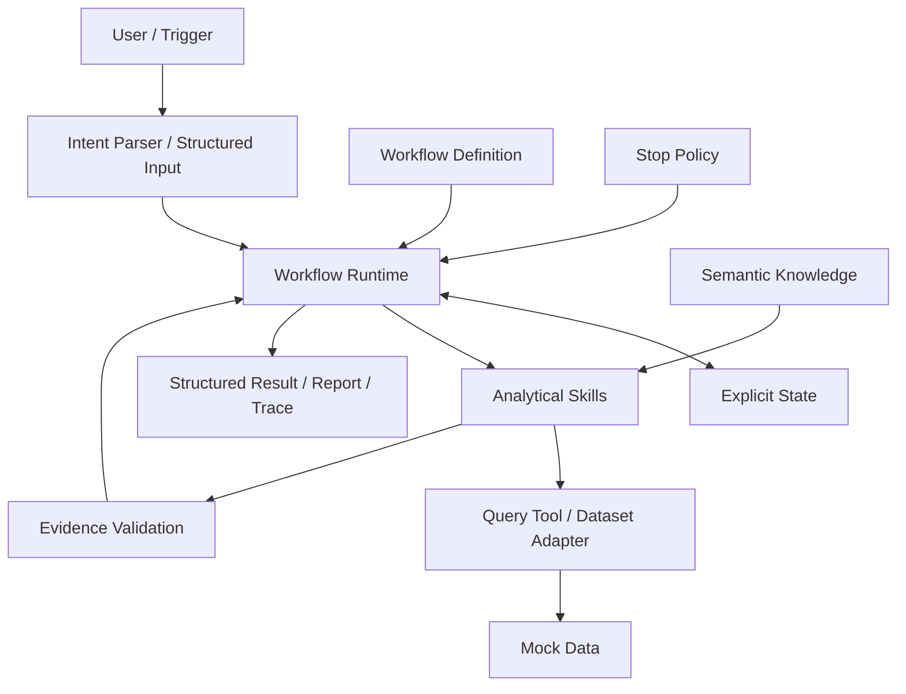

# Business Performance Agent

## Overview

Business Performance Agent 是一个面向经营运营场景的独立 Python 分析 Agent。项目将业务语义、分析动作与执行流程分别定义，通过显式状态机完成 GMV 异常诊断，并返回可追踪的结构化结果与报告。

**Version: 0.1.0 · Status: Functional Prototype**

当前使用 Mock Dataset 和离线 Mock LLM 验证分析流程，无需 API Key 或数据库。示例结果不代表真实经营情况。

## Motivation

经营分析中经常需要重复完成一组步骤：比较两个周期的指标、判断异常、拆解变化、沿维度下钻，再整理结论与依据。若每次临时确定口径和路径，容易出现指标定义不一致、重复计数、贡献无法闭合，或结论超出数据支持范围的问题。

本项目尝试把这些重复工作整理为可复用、可检查的分析流程：用结构化 Knowledge 固定业务语义，用确定性 Skill 执行计算，用 Workflow 控制分析顺序和停止条件，让每个核心结论都能对应到证据。

## Features

- **周期比较与异常判断**：按配置阈值比较 GMV，返回绝对变化、相对变化与异常状态。
- **指标分解与贡献诊断**：读取合法指标关系，计算乘法、加法和方向对齐贡献，并执行闭合检查。
- **多维下钻**：在合法候选中选择维度，区分描述性比较和严格贡献分析。
- **数据质量与证据校验**：检查数据可用性、语义一致性及 Claim 的证据支持。
- **显式流程与失败处理**：维护 State，执行路由、停止策略、有限重试与 partial completion。
- **结构化输出与 Trace**：提供 JSON 或文本报告，每次运行生成独立 run_id 和本地追踪记录。

当前可执行 Workflow 为 `gmv_diagnosis`，通过 CLI 按需触发；尚无持续监控或定时调度服务。

## Architecture

| 层 | 职责 |
|---|---|
| Knowledge | 定义指标、公式、关系、维度及贡献适用性，是业务语义真源 |
| Skill | 完成单一可复用分析动作，不决定完整任务流程 |
| Workflow | 定义任务节点、合法路径、状态流转与停止策略 |
| Runtime | 加载 Workflow、执行节点、更新 State、调用 Skill 并记录 Trace |
| Tool / Dataset Adapter | 执行读取与计算，将 Semantic ID 映射到物理数据字段 |




详细设计见 [ARCHITECTURE.md](docs/ARCHITECTURE.md)。业务规范位于 `specs/`，可执行实现位于 `business_performance_agent/`。

## How It Works

以 GMV Diagnosis 为例：

1. **校验请求和数据**：读取目标指标、当前周期、基准周期和筛选条件，初始化 State，执行 Data Quality Guard。
2. **比较并判断异常**：计算 GMV 变化，按 Policy 判断是否需要继续诊断。
3. **分解指标**：从 Knowledge 读取 `gross_gmv = orders × aov`，计算各 Driver 的贡献并检查闭合。
4. **沿合法路径下钻**：选择 Driver 与后续合法关系或维度；每一步检查数据质量、贡献适用性、深度、贡献阈值和覆盖率。
5. **在边界停止**：达到停止条件或缺乏合法路径、数据或证据时，记录准确原因，保留已有可靠结果和限制。
6. **生成结果**：校验核心 Claim 的 Evidence，输出结构化结果，再渲染报告并保存 Trace。

## Quick Start

需要 Python 3.11+。下载或 clone 后进入项目根目录，创建并激活虚拟环境，再执行：

```bash
python -m pip install -e .
python -m business_performance_agent --input examples/gmv_input.json --mock-llm --json
```

未提供 `--input` 或 `--question` 时会执行内置 Mock 示例（默认不启用 Mock LLM）。建议显式传入示例文件。

去掉 `--json` 可查看文本报告。运行软件测试：

```bash
python -m unittest discover -s tests -v
```

环境创建、安装与排错见 [QUICKSTART.md](QUICKSTART.md)。当前采用完整源码目录 + editable 安装，需保留 `specs/`。Codex 是可选的开发 / 操作集成，见 [使用说明](docs/CODEX_USAGE.md) 与 [AGENTS.md](AGENTS.md)。

## Example

**Mock / synthetic example，非真实经营数据。** 以下请求使用固定示例周期，来自 [gmv_input.json](examples/gmv_input.json)：

```json
{
  "metric_id": "gross_gmv",
  "current_period": {"start": "2026-08-31", "end": "2026-09-06"},
  "baseline_period": {"start": "2026-08-24", "end": "2026-08-30"},
  "filters": {},
  "context": {}
}
```

运行后的主要结果如下；这是完整输出的摘要：

| 字段 | 示例值 |
|---|---|
| workflow_status | completed |
| 基准 GMV / 当前 GMV | 10,000 / 7,350 |
| absolute_change / relative_change | −2,650 / −0.265（−26.5%） |
| primary_driver.metric_id | orders |
| Orders 对第一层 GMV 变化的 effect | −2,475 |
| stop_reason | target_coverage_reached |

CLI JSON 同时包含 `execution_mode`、`run_id`、`result` 和 `trace_path`。查看 [完整业务结果快照](examples/demo_result.json) 与 [示例报告](examples/demo_report.md)；公开快照省略随机运行 ID 和本机日志路径。

该结果支持内部贡献定位，不证明广告竞价、竞争或用户心理等外部原因。不同层的贡献份额不能自动相乘为 GMV 总贡献。

## Repository Structure


```text
.
├── business_performance_agent/
│   ├── app/
│   ├── config/
│   ├── data_contract/
│   ├── llm/
│   ├── models/
│   ├── runtime/
│   ├── skills/
│   ├── tools/
│   └── workflows/
├── specs/
│   ├── product_scope.md
│   ├── system_contract.md
│   ├── knowledge/
│   ├── skills/
│   └── workflows/gmv_diagnosis/
├── tests/
├── examples/
├── docs/
├── .github/workflows/tests.yml
├── AGENTS.md
├── QUICKSTART.md
├── pyproject.toml
└── run.ps1
```

`logs/` 在运行时创建并被 Git 忽略；本地环境和构建产物不属于源码。

## Design Principles

- **Semantic source of truth**：业务语义仅由 Knowledge 定义；所有层使用稳定 ID，运行时不修改指标或关系。
- **Deterministic calculation**：数值、贡献、闭合、排序和阈值比较均由 Python 计算；零分母保留 undefined/null。
- **Constrained routing**：可程序判断的路径直接选择；仅在多个合法候选且 Workflow 允许时调用模型，模型不能创造新路径。
- **Evidence boundary**：核心 Claim 只能引用 direct / derived Evidence；证据不足时停止，不补充无依据的商业解释。
- **Contribution applicability**：严格贡献必须满足可加性等语义约束，例如 Orders × Category / Product 只能描述性比较。
- **Explicit state and separation**：流程进度由 State 保存，语义、编排、计算和数据访问各自独立。

## Current Limitations

- **Mock LLM**：离线接口替身，不具备真实模型的语义理解能力；尚未接入真实 Provider。
- **Mock Dataset**：仅使用固定合成数据；尚未接入真实数据库或业务文件。
- **Workflow scope**：当前仅支持 GMV diagnosis，不提供自由规划或任意经营问题分析。
- **Evaluation**：已有软件测试，尚未实现 Eval，也未验证真实经营分析效果。
- **Deployment**：功能原型，支持源码 + editable 安装；不提供独立 wheel、生产部署、UI 或自动业务动作。
- **Validation**：本地验证在 Windows Python 3.12；CI 配置覆盖 Windows / Ubuntu 与 Python 3.11 / 3.12，远端结果以 GitHub Actions 为准。

## Roadmap

以下为后续方向，均尚未实现：

- 接入真实 Dataset Adapter，验证字段映射、数据质量和只读访问边界。
- 接入真实 LLM Provider，保持 Intent、受约束路由和报告表达三个职责。
- 建立独立 Eval，检验分析正确性、路径选择与证据支持程度。

后续扩展继续遵守现有语义契约、贡献适用性和证据边界。
