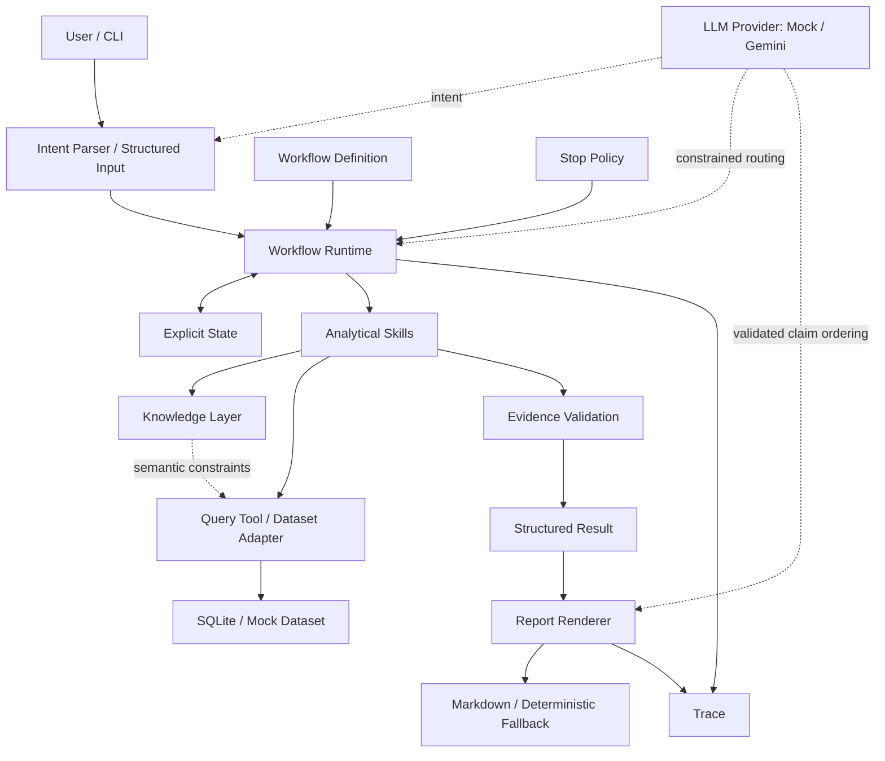

# Business Performance Agent

## Overview

Business Performance Agent 是可本地部署的 specification-driven analytical agent，支持真实 SQLite 数据源和 Gemini API，并保留完整离线 Mock 模式。

**Version: 0.1.0 · Status: Functional Agent with SQLite and Gemini Integration**

当前 reference workflow 为 **GMV Diagnosis**，覆盖按需 KPI 检查、周期比较、异常检测、指标拆解、贡献分析、多维下钻、证据支持的诊断和结构化报告。项目组合了 Structured Business Knowledge、Deterministic Analytical Skills、Stateful Bounded Workflow、Constrained LLM Routing、Dataset Adapter 和 Evidence Validation。分析顺序与数值计算由程序和规范控制，LLM 不自由接管取数、计算或规划。

这是独立个人工程项目，尚未经过企业生产环境的长期运行验证。

## Why This Project

经营分析经常重复检查 KPI、比较周期、拆解变化、逐层下钻，再整理报告。临时决定口径和路径容易造成定义不一致、重复计数、贡献不闭合，以及超出证据范围的解释。本项目将这些工作整理为可复用的分析动作和显式流程，让每次运行能够核对定义、路径、停止原因及核心结论的证据。

## Core Capabilities

- 周期比较和按配置阈值执行异常检测。
- 从 Knowledge 读取合法关系，确定性计算乘法、加法、方向对齐贡献及闭合检查。
- 在允许的关系和维度中下钻，区分描述性比较与严格贡献归因。
- Data Quality Guard、显式 State、Stop Policy、partial completion 和 Evidence Validation。
- Mock / SQLite Dataset Adapter 与 Query Tool；业务层使用稳定 Semantic ID。
- Mock / Gemini Provider 切换，支持意图解析、受约束路由和已验证报告内容的编排。
- Provider 有限重试、确定性 Markdown 回退、本地 JSON Trace 和 CLI。

## Architecture



Knowledge 定义业务语义；Skill 定义单一分析动作；Workflow 定义编排与状态流转；Runtime 执行流程；Tool / Adapter 读取物理数据。详见 [Architecture](docs/ARCHITECTURE.md)。

## How It Works

GMV Diagnosis 的典型链路：

1. 校验输入与数据质量，比较当前和基准周期，判断是否异常。
2. 按 `gross_gmv = orders × aov` 拆解，选择主要同向 Driver。
3. 沿合法的下一层分解或维度下钻，检查贡献适用性和停止条件。
4. 校验 Evidence，保留 supported Claims，生成 structured result。
5. 渲染报告并保存 Trace；数据不足、语义冲突或外部因果边界会使分析停止。

无异常时可提前完成，路径也依赖数据可用性。接通数据库不等于数据已通过质量检查。

## Supported Runtime Modes

| 模式 | 组件 | 用途 |
|---|---|---|
| Mock Mode | Mock LLM + synthetic dataset | 离线开发、CI、可复现演示；无需 API Key |
| SQLite + Mock LLM | SQLite + 原有分析 Workflow + Mock LLM | 真实数据接入与数据层调试，不依赖模型服务 |
| SQLite + Gemini | SQLite + 原有分析 Workflow + Gemini | 真实意图解析、合法候选选择和报告编排；需要 `GEMINI_API_KEY` |

当前 SQLite 实现面向 **Olist 原始表结构**，任意 SQLite 文件不会自动兼容，见 [数据源说明](docs/DATA_SOURCES.md)。也可不配置 LLM，执行可确定的节点，并在需要模型选择时保留停止原因。

## Quick Start

需要 Python 3.11+。进入包含 `pyproject.toml` 的项目根目录，在已激活的虚拟环境中执行：

```bash
python -m pip install -e .
python -m business_performance_agent --input examples/gmv_input.json --mock-llm --json
```

去掉 `--json` 查看 Markdown 报告。三种模式的完整步骤见 [QUICKSTART.md](QUICKSTART.md)。当前采用完整源码目录 + editable 安装，需保留 `specs/`；CLI 不要求使用 Codex。

## Configuration

| 配置 | 实际入口 |
|---|---|
| 数据源 | 无 `--database` 使用 Mock；`--database PATH` 只读打开 Olist SQLite |
| Provider | `--mock-llm` 或 `--gemini`，两者互斥；均不提供则未配置 LLM |
| API Key | Gemini Provider 读取进程环境变量 `GEMINI_API_KEY` |
| 模型 | `--model`（要求 `--gemini`）优先于 `GEMINI_MODEL`；默认 `gemini-3.8-flash` |
| 输入 | `--input PATH` 或 `--question TEXT`，两者互斥；SQLite 必须显式提供其一 |
| 映射 | Adapter 内的 SQL/字段转换及 `data_contract/olist_mapping.json`；没有 `--mapping` 参数 |

API Key 不写入代码或 Git。[`.env.example`](.env.example) 仅说明变量，程序**不会自动加载 `.env`**。Gemini 可选依赖通过 `python -m pip install -e ".[gemini]"` 安装。

## Example

**Synthetic Example：以下使用固定 Mock 数据，不代表真实经营情况。** Agent 同时支持 SQLite，但此示例不使用数据库。

```json
{
  "metric_id": "gross_gmv",
  "current_period": {"start": "2026-08-31", "end": "2026-09-06"},
  "baseline_period": {"start": "2026-08-24", "end": "2026-08-30"},
  "filters": {},
  "context": {}
}
```

| 结果字段 | Mock 示例值 |
|---|---|
| workflow_status | completed |
| 基准 / 当前 GMV | 10,000 / 7,350 |
| absolute_change / relative_change | −2,650 / −0.265 |
| primary_driver.metric_id | orders |
| 第一层 Orders effect | −2,475 |
| stop_reason | target_coverage_reached |

见 [示例分类](examples/README.md)、[业务结果快照](examples/demo_result.json) 和 [示例报告](examples/demo_report.md)。CLI 返回 `run_id`、`result`、`trace_path`、`execution_mode`；Gemini 模式还返回 `report`。公开快照省略本机路径和随机运行 ID。

## Reliability

- 数值、贡献、闭合、排序和阈值判断使用 deterministic Python；零分母返回 undefined/null。
- Knowledge 是唯一语义真源；LLM 不定义指标、不猜 Schema、不选择 `allowed_candidates` 之外的路径。
- 核心 Claim 仅使用 direct / derived Evidence；内部贡献不构成外部因果证明。
- SDK 设为 `attempts=1`；应用层对暂时性 Provider 故障最多重试一次，间隔 2 秒，单请求超时 60 秒。429 / 503 / 504 属于该范围。
- Gemini report 最终失败时，仅从原 structured result 的结论、状态、警告和限制生成确定性 Markdown，不新增原因或建议。该回退不替代失败的意图解析或路由。
- SQLite 使用只读连接、查询授权、表/列白名单、时间和行数限制；超限不截断成看似完整的结果。
- 报告 Trace 包含 `report_renderer`（`gemini` / `deterministic_fallback`）、`provider_error_code`、`retry_count`；恢复成功后仍可保留最近一次错误码。

## Testing

未设置 `GEMINI_API_KEY` 时，以下命令运行离线测试并跳过 live Gemini 测试：

```bash
python -m unittest discover -s tests -v
```

测试覆盖计算、Skills、State、路由、贡献边界、SQLite、Provider 校验、重试次数、回退和 CLI Trace。已设置 Key 时测试发现会包含 live 调用；强制离线及可选 live 命令见 [Testing](QUICKSTART.md#testing)。Live 测试使用 **synthetic SQLite fixture**，不能作为真实 Olist 数据通过验收的证据。

## Repository Structure

```text
.
├── business_performance_agent/
│   ├── app/                 # CLI、独立工具实验和报告诊断
│   ├── config/              # Settings、Provider 和只读策略
│   ├── data_contract/       # Mock / SQLite Adapter、Olist 导入及映射
│   ├── llm/                 # Mock / Gemini、Intent、Router、Result / Report
│   ├── models/              # 结构校验与模块结果
│   ├── runtime/             # State、Engine、Executor、Router
│   ├── skills/              # 七个分析 Skill
│   ├── tools/               # Knowledge Loader、Query、Schema、计算
│   └── workflows/          # 冻结 Workflow 的加载器
├── specs/                  # Product Scope、Knowledge、Skills、Workflow、契约
├── tests/                  # 离线测试、可选 live 测试和 synthetic fixture
├── examples/               # Mock 快照及 Olist 周期输入
├── docs/
├── .github/workflows/tests.yml
├── .env.example
├── AGENTS.md
├── QUICKSTART.md
├── pyproject.toml
└── run.ps1
```

本地 `data/*.db` 和运行时 `logs/` 不作为公开示例提交。`run.ps1` 保留基础输入、Mock 和测试入口；SQLite/Gemini 使用 Python CLI。

## Current Scope

核心 Workflow 为 `gmv_diagnosis`，按需触发 KPI 检查和异常诊断。尚无持续监控服务、定时调度或完整 Daily Business Inspection orchestration，也不执行自动业务动作。

## Current Limitations

- SQLite 数据源已实现，当前适配 Olist 原始 Schema；其他 Schema 需要适配数据层代码。
- Olist 缺少可靠的新老客历史、渠道、Campaign、确认退款及实际配送地区，相关能力禁用。
- 真实 Olist 请求可能因缺失商品明细或支付时间而 blocked；synthetic SQLite 流程通过不等于真实数据完整 E2E 成功。
- Gemini availability / quota 由外部 Provider 决定，有限重试不能保证成功。
- 尚未实现系统化 Eval framework，未经过生产环境长期运行验证。
- 当前为源码 + editable 本地交付，尚非独立服务、复杂 UI 或经验证的独立 wheel 发布方案。

## Roadmap

- 增加有明确规范的诊断 Workflow。
- 实现 Daily Business Inspection 编排。
- 扩展数据库 Adapter 和可验证的数据契约。
- 建立 Eval framework，评估分析正确性与证据支持。
- 在本地 Trace 基础上改善运行观测与排错体验。

后续扩展继续保留确定性计算、语义真源、合法路由和证据边界。
