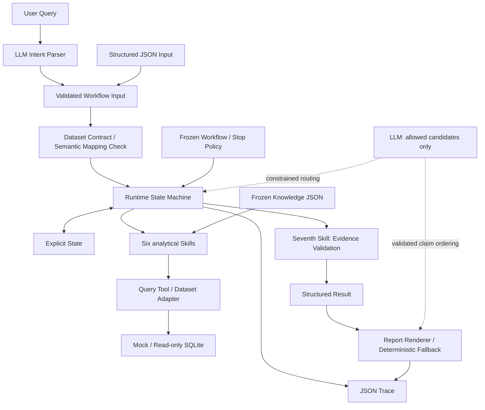

# Business Performance Agent

**v0.1 · Portfolio Release Candidate · 独立个人项目**

## Overview

把自然语言经营问题转成可追踪的 GMV 诊断：先校验业务口径和数据能力，再用确定性程序比较周期、拆解贡献、按规则下钻，最后组织有证据的报告。LLM 负责语言和有限候选选择；指标定义、取数映射、计算和停止条件由规范与代码控制。

已接入 **1,469,307 行 Complete Journey 公开历史零售交易**，提供真实数据 Demo、可复现 SQLite 准备流程、Mock / Gemini / DeepSeek Provider，以及保留失败的离线与 Live 评测历史。当前是本地分析原型，未宣称生产部署或因果推断能力。

[离线运行](QUICKSTART.md) · [真实数据 Demo](examples/real_data/completejourney/portfolio.md) · [评测结果](docs/portfolio/evaluation.md) · [项目讲解](docs/portfolio/project_overview.md)

## Why This Project

周期比较、指标拆解、贡献排序和报告整理是重复的经营分析工作。临时定义口径或让模型自由决定计算路径，会使结果难以复核。本项目将业务知识、分析动作和任务编排分开，让“为什么走这条路径”“证据来自哪里”“为什么停止”都能追溯。

## Architecture



Knowledge 定义语义；Skill 执行单一分析动作；Workflow 定义编排；Runtime 管理状态；Tool / Adapter 读取数据。六个分析 Skill 为 `data_quality_guard`、`metric_compare`、`anomaly_evaluate`、`metric_decompose`、`contribution_analysis`、`dimension_drilldown`，第七个为 `evidence_validate`。契约检查在数据层及 Runtime 入场节点执行，不是另一个 Agent。[完整架构](docs/ARCHITECTURE.md)。

## Core Capabilities

- GMV 周期比较、异常阈值判断、Orders × AOV 分解及合法维度贡献分析。
- Python 确定性计算差值、贡献、方向对齐、闭合、排序与覆盖率。
- 正式 State、合法候选约束、深度与证据停止条件；支持 partial / blocked。
- 显式 Semantic ID 映射、只读 SQLite、结构化 Evidence 和本地 Trace。
- 离线 Mock；可选 Gemini / DeepSeek；有限 Provider 重试和报告回退。

## Real-Data Demo

Complete Journey 的 `gross_gmv` 使用经批准的数据集契约：**零售商商品销售所得**，不是顾客自付金额或货架标价。2017 年 1 月与 12 月均为 31 天，比较是描述性的，不证明季节原因。

| 已保存示例 | 观察结果 | 边界 |
|---|---|---|
| [根 Driver](examples/real_data/completejourney/portfolio.md#demo-a--root-driver) | GMV 370,886.93 → 421,882.29；AOV 同向贡献 77.79% | 更深数量拆解不可用，partial |
| [Category](examples/real_data/completejourney/portfolio.md#demo-b--category) | 合法 GMV × category 路径及本层贡献排名 | 不把类别名称解释为外部原因 |
| [不支持的 Channel](examples/real_data/completejourney/portfolio.md#demo-c--unsupported-channel) | 意图被识别；数据能力检查 blocked | 无虚构渠道归因，核心 claims 为空 |

两次准备产物哈希一致；四场景离线与 Live 已保存结果一致性验证通过。[真实数据契约与验证](docs/COMPLETEJOURNEY.md)；无需下载原始数据即可阅读 Demo。

## Evaluation

| 验证范围 | 冻结结果 |
|---|---|
| Golden regression | Round 3：12/12 PASS |
| 原 Holdout v1，离线 | Round 4：13/20 PASS |
| 修复前混合 Provider Live | Round 6：9/20 PASS |
| 修复后纯 DeepSeek regression | Round 7：16/20 PASS；计算 19/19；路径 17/19；嵌套 Driver 2/4 |
| Round 7 Evidence / 约束 | Evidence 52/52；unsupported claims 0/52；hard violations 0 |

**Holdout v1 已用于诊断和修复，现为 regression set，不再是未见测试集。** 四个失败保留；分母只统计适用检查，不能把 100% 子指标等同于整体正确率。修复前后 Provider 构成不同，不能作为受控模型比较。[Eval 与可靠性概览](docs/portfolio/evaluation.md)。

## Reliability / Evidence Boundaries

唯一候选确定性选择；多个合法候选才允许模型选择或返回 `no_valid_choice`。核心 Claim 必须有 direct / derived Evidence，内部贡献不等于外部因果。模型报告当前仅编排已验证 Claim，不自由添加事实。

Provider 暂时故障有限重试；Gemini SDK `attempts=1`，应用最多重试一次，避免叠加。报告最终失败以现有 structured result 确定性生成 Markdown；不会掩盖意图解析失败。Trace 记录 renderer、错误码与重试次数。

## Quick Start

Python 3.11+，在包含 `pyproject.toml` 的完整源码目录执行。默认不需要 API Key 或原始数据。

```powershell
python -m venv .venv
.\.venv\Scripts\python.exe -m pip install -e .
.\.venv\Scripts\python.exe -m business_performance_agent --input examples/gmv_input.json --mock-llm
.\.venv\Scripts\python.exe -m business_performance_agent --input examples/gmv_input.json --mock-llm --json
.\.venv\Scripts\python.exe -m unittest discover -s tests -v
```

macOS/Linux 使用 `.venv/bin/python`。Mock 输出 GMV 10,000 → 7,350，主 Driver 为 Orders，停止于 `target_coverage_reached`。[完整 Quick Start 与可选 Live](QUICKSTART.md)。

## Repository Structure

```text
business_performance_agent/  # Runtime、7 Skills、LLM、Models、Tools、Adapters
specs/                      # 冻结 Knowledge、Skill、Workflow 与系统契约
data/contracts/            # 数据集专用语义契约
data/mappings/             # 显式物理映射
scripts/                    # Complete Journey 准备和演示入口
examples/                   # Mock 示例和真实数据记录
evals/                     # Case、Expected、Runner、Grader、冻结历史
tests/                     # 离线测试及显式 opt-in Live 测试
docs/portfolio/            # 项目介绍、评测概览、简历、面试与发布审计
.github/workflows/          # 无付费 API 的离线 CI
```

## Known Limitations

- Complete Journey 数量单位、退款/net_gmv、channel/region/campaign 和生命周期新老客能力未支持；household 不等同个人客户。
- 当前仅一个 GMV Workflow、规范化单表 SQLite 和本地运行；未验证生产规模服务、持续监控或实时分析。
- Eval 是有限合成场景；嵌套路径仍有问题，没有独立未见 Holdout v2。
- 外部 Provider 可出现 429/503/504；少量成功请求不能证明长期可靠性。
- 采用完整源码 + editable 安装，必须保留 `specs/`；未验证独立 wheel 分发。数据来源见 [获取说明](examples/real_data/completejourney/README.md)。

## Design Decisions

确定性计算保障可复核；Knowledge JSON 保持唯一业务语义真源；Dataset Contract 把可分析能力与物理字段分开；受约束路由限制模型自由度；证据不足时保留 partial 或 blocked，不补完整商业故事。

生产化后优先做数据质量与契约版本管理、独立新评测集、访问控制和运行容量验证；这些是计划，不是当前实现。[设计与失败复盘](docs/portfolio/project_overview.md)。

## License

当前仓库未指定软件许可证；公开展示不等于授予开源复用许可。本轮未替作者选择许可。Complete Journey 原始数据不随仓库分发，获取和使用须遵循上游来源条款。
