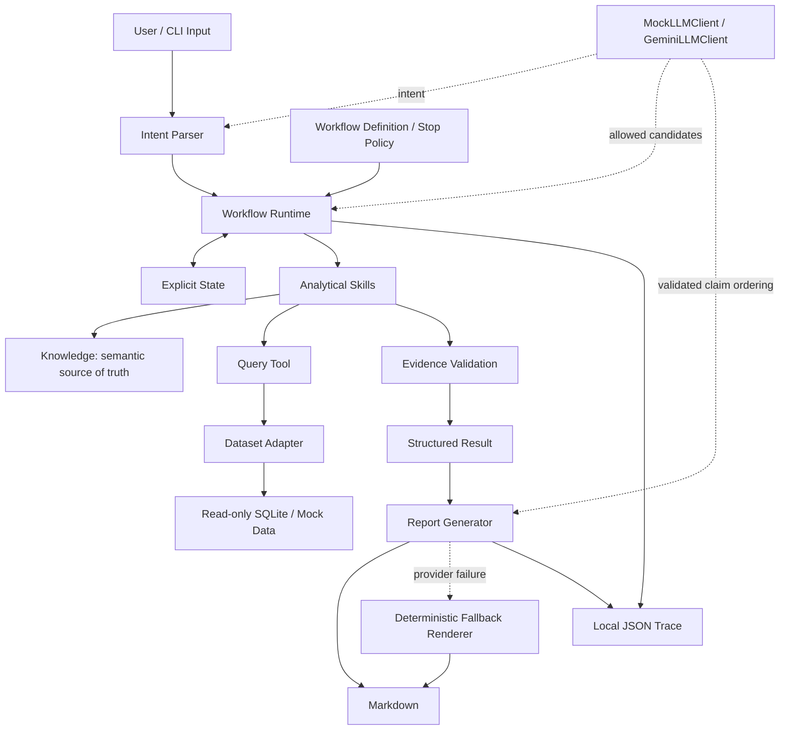

# Architecture

Business Performance Agent 是可本地部署、集成 SQLite 与 Gemini 的 specification-driven 分析 Agent。`specs/` 定义冻结业务契约，Python 实现执行契约；尚未经过企业生产环境的长期验证。

## Runtime structure

## Responsibility boundaries

| 模块 | 实现 | 职责 |
|---|---|---|
| Knowledge | `tools/knowledge_loader.py`、`specs/knowledge/` | 指标、公式、关系、维度、规则和贡献适用性的唯一真源 |
| Skill | `skills/` | 七个单一分析动作，不决定下一步、不改语义 |
| Workflow | `specs/workflows/gmv_diagnosis/`、`workflows/definition.py` | 合法节点、状态、路由、停止策略及输出结构 |
| Runtime | `runtime/` | 初始化 State、执行节点、调用 Skill、路由和保存记录 |
| Data boundary | `data_contract/`、`tools/*query_tool.py` | 稳定 Semantic ID 到真实字段的读取与转换 |
| LLM | `llm/` | 意图解析、合法候选选择、已验证报告内容编排 |
| Application | `app/cli.py` | 选择 Provider / 数据源、读取输入、渲染并输出 |

表中代码路径相对于 `business_performance_agent/`，规范路径相对于项目根目录。核心运行不依赖大型 Agent Framework。

## State, routing and calculations

正式 State 保存目标/当前指标、周期、当前节点、路径、关系、Driver、Dimension、深度、Evidence、警告、限制和停止原因。Workflow Loader 读取 Markdown、State、Routing、Policy 和 Output Schema，并保存规范文件指纹；描述性 State Schema 不被当成通用 JSON Schema。

数值、乘法/加法贡献、闭合、排序、覆盖率和阈值比较由 Python 完成，零分母保留 undefined/null。Skill 从 Knowledge 读取公式，不创建第二套指标定义。

是否异常、最大 Driver 和停止阈值采用确定性判断。只有多个合法候选且 Workflow 允许时才调用 LLM；返回只能属于 `allowed_candidates` 或 `no_valid_choice`。唯一候选直接选择。LLM 不定义指标、不猜物理 Schema、不绕过 Stop Policy 或 Evidence Boundary。

每个新增分析范围执行 Data Quality Guard。Semantic conflict 阻断；已有证据而分支失败时按 Policy 保留 partial、`failed_branches` 和限制。软件故障重试与 Provider 报告重试各自记录，不混入业务状态。

## Data adapters

`DatasetAdapter` 定义 metric、segments、quality、能力和 schema 接口。Mock 模式由 `MockDatasetAdapter` / `MockQueryTool` 提供固定合成数据；SQLite 模式由 `SQLiteDatasetAdapter` / `SQLiteQueryTool` 读取 Olist 原始表。

SQLite Adapter 内部生成 SQL，Skill 不接触物理列名。连接使用 `mode=ro` 与 `query_only`，通过 SQLite authorizer 控制表、列和函数访问，以 progress handler 控制超时，以返回行数上限防止静默截断。当前默认查询超时 15 秒、行数上限 250000；它们在 Adapter/ReadOnlyPolicy 中配置，没有对应 CLI 覆盖参数。

原始导入与分析分开：`olist_raw.py` 创建新的本地 staging 数据库，拒绝覆盖目标；分析阶段不修改库。来源摘要、数据库指纹与运行中变化检查支持追溯。它是本地历史快照适配，不是通用数据库权限系统。

`olist_mapping.json` 与 Adapter 中的 SQL/转换共同表达 Olist 映射；不是只靠编辑 JSON 就能接入任意 Schema。缺少稳定新老客历史、渠道、退款或配送地区时，相应能力禁用。详见 [DATA_SOURCES.md](DATA_SOURCES.md)。

## Evidence and contribution boundaries

查询与分解输入形成 direct Evidence，确定性推导形成 derived Evidence。Evidence Validator 核对 Claim 的事实、范围与引用，unsupported 核心 Claim 不进入最终结果。

严格贡献依赖 Knowledge 中的 Relationship 或 Metric × Dimension 适用性。Orders × Category / Product 只能描述性比较，不能输出严格贡献占比；unknown 保留。层内贡献份额不自动相乘成跨层 GMV 总贡献。内部变化不证明竞争、市场或用户心理等外部因果。

## LLM provider and report reliability

`MockLLMClient` 是离线替身；`GeminiLLMClient` 使用官方 `google-genai`，读取 `GEMINI_API_KEY`，模型由 `--model` / `GEMINI_MODEL` / 默认配置选择。两者共用 Intent、Routing 和 Report 接口。Gemini 使用非流式结构化输出并进行本地校验，不自由调用 SQL 或计算工具。

Report Generator 只发送已验证 Claim 的 ID 和认可文本。模型返回 Claim 顺序及认可的 variant，不能添加结论；状态、警告和限制由程序保留。Gemini 成功时优先使用其合法编排，最终失败或输出越界时用同一 structured result 生成确定性 Markdown。

SDK `attempts=1` 禁止内部重试叠加；应用默认最多两次尝试、额外等待 2 秒，单次超时 60 秒。429 / 503 / 504 及实现中列明的其他暂时性故障可重试，结构错误也受相同总次数上限约束。报告回退不会修复失败的意图解析、路由或数据质量检查。

## Trace and validation status

Workflow Trace 记录 run_id、Workflow ID/版本、输入、规范指纹、节点、State 快照、Skills、路由、警告、限制、Evidence、停止原因和最终业务结果。

SQLite 增加数据源、数据库 SHA-256、SQL 操作及语义查询 provenance；缓存命中引用原查询。CLI 增加 execution_mode。执行报告渲染时增加 `report_renderer`、`provider_error_code`、`retry_count` 和 rendered_report；报告重试次数不同于 State 中的 Skill 重试次数。Provider 记录脱敏错误元数据，不保存 Key 或完整 API 错误正文。

完整 synthetic SQLite 测试、实际 Olist 数据质量检查与可选 live Gemini 测试是不同验证层。连接成功不能证明真实数据完整可用；report fallback 成功也不能证明 Gemini 服务恢复。软件测试尚不构成系统化 Eval 或生产长期运行验证。

运行命令见 [QUICKSTART](../QUICKSTART.md)，语义契约见 [system contract](../specs/system_contract.md)。
