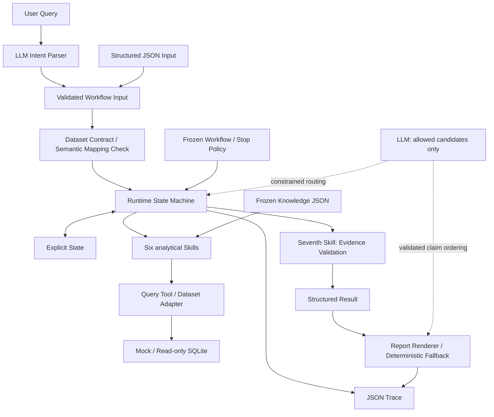

# Architecture

## Formal runtime



Knowledge 是唯一业务语义真源；七个 Skill 只负责单一动作；Workflow 定义任务级编排；Runtime 执行状态机；Tool / Adapter 负责数据读取。业务指标、关系、维度、路由、停止条件与 Evidence Boundary 来自 `specs/`，不在 LLM 中重定义。

## Deterministic and agentic boundaries

| 责任 | 实现与规范入口 |
|---|---|
| Intent / Input validation | `llm/intent_parser.py`、`models/schemas.py` |
| Dataset capability / mapping | `data_contract/record_adapter.py`、`sqlite_adapter.py`；仓库 `data/contracts/`、`data/mappings/` |
| Runtime / State / routing / stop | `runtime/engine.py`、`state.py`、`router.py`；`specs/workflows/gmv_diagnosis/` |
| Six analytical Skills | `skills/data_quality_guard.py`、`metric_compare.py`、`anomaly_evaluate.py`、`metric_decompose.py`、`contribution_analysis.py`、`dimension_drilldown.py` |
| Seventh Skill / Result | `skills/evidence_validate.py`、`llm/result_builder.py` |
| Semantic source / deterministic math | `tools/knowledge_loader.py`、`calculations.py`；`specs/knowledge/` |
| Provider / report | `llm/providers.py`、`gemini_client.py`、`deepseek_client.py`、`report_generator.py` |

代码路径以 `business_performance_agent/` 为根。数据契约检查是 Adapter / Runtime 的入场职责，图中不是额外执行服务。

数值比较、乘法/加法贡献、方向对齐、闭合、排序、阈值与深度判断使用 Python。只有多个合法候选需要语义选择时，LLM 接收 `allowed_candidates` 并返回其中之一或 no_valid_choice。唯一候选确定性选择。

LLM 只处理 Intent、Constrained Routing、Report Rendering。Report 只编排已验证 Claim，状态、警告、限制由程序保留。最终核心 Claim 仅使用 direct / derived Evidence；内部贡献不证明外部因果。

## Data boundary

`MockDatasetAdapter` 与可配置单表 `SQLiteDatasetAdapter` 复用 `SemanticRecordAdapter` 的原有记录聚合语义。映射显式提供，SQLite 数据来源另行声明，不能从 backend 推断真实性。金额和时间口径不由数据集自由定义。详见 [Data Sources](DATA_SOURCES.md)。

只读 SQLite 查询授权、白名单、超时/行数限制和快照检查在数据层执行；Skill 仅传 Semantic ID。当前无通用多表 ETL 或生产权限系统。

## Reliability and Trace

Gemini SDK attempts=1，应用最多两次尝试，间隔 2 秒，单次超时 60 秒。429/500/502/503/504 与网络暂时故障有限重试。报告失败回退为基于既有结果的确定性 Markdown，不扩展原因或建议，不替代失败的意图或路由。

每次运行记录 run_id、Workflow 版本、节点、Skills、State、路由、Evidence、警告、限制、停止原因和最终结构化结果。SQLite 记录指纹和查询引用；报告记录 report_renderer、provider_error_code、retry_count。日志不提交 Git。

## Separate evaluation support

第一版 Offline Runner / Graders 已提供，见 [Eval 文档](../evals/README.md)。

```text
Synthetic records -> Fixture -> Agent -> Actual result
                                         |
                              Expected loaded only now
                                         |
                                  Deterministic graders
```

`evals/support/` 是独立数据准备层。它不加载 Expected，不把 case_id 传给 Agent；正式 Runtime 不导入 evals。Cases 描述 Agent 行为，tests 验证软件正确性。Offline Runner 执行后才加载 Expected 评分，结果保存到被忽略的 evals/results/。

